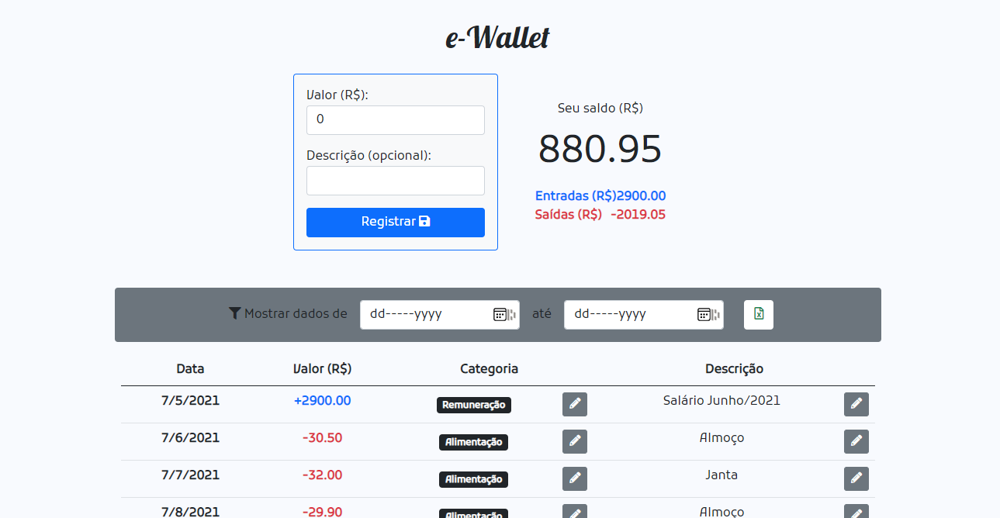

<h1 align="center">
   e-Wallet
</h1>

<p align="center">
  
</p>

# Desafio Backend NodeJS

Essa aplicação foi desenvolvida como parte de um teste técnico para a vaga de Desenvolvedor NodeJS, com base [neste enunciado](./.github/desavio-tecnospeed.pdf).

Objetivos requisitados e implementados:

- [x] Nível 1
  - [x] Cadastrar movimentações financeiras de entrada e saída de dinheiro;
  - [x] Permitir cadastrar observações para cada movimentação financeira;
  - [x] Mostrar quanto dinheiro tenho na carteira;
- [x] Nível 2
  - [x] Permitir cadastrar (e editar) categorias para informar em cada movimentação financeira;
- [x] Nível 3
  - [x] Gravar um histórico de entradas e saídas de dinheiro da carteira;
  - [x] Permitir visualizar todo o histórico de movimentação de uma carteira de um determinado período;
  - [x] Permitir exportar todas as movimentações de um determinado período em formato CSV;
- [ ] Nível 4
- [ ] Nível 5
- [ ] Nível 6
- [ ] Nível 7

Por questões de tempo, decidi não implementar os demais níveis de requisito, apesar de tocar parcialmente em alguns deles.

## :stopwatch: Tempos despendidos no desafio

Como parte do desafio, cronometrei o tempo gasto em cada uma das atividades, sem contar pausas e interrupções, com auxílio de um cronômetro simples.

- Nível 1:
  - 0h30 Setup inicial do projeto;
  - 0h30 Setup do banco de dados;
  - 0h20 Criação da entidade 'Transaction';
  - 4h50 Rotas, controllers, resources e validações;
  - 1h00 Testes;
  - 1h30 Frontend;
- Nível 2:
  - 0:30 Criação da entidade 'Category' e relacionamentos;
  - 2h00 Rotas, controllers, resources e validações;
  - 0h50 Testes;
  - 1h30 Frontend;
- Nível 3:
  - 0h15 Adcionar detalhes de entradas e saídas de dinheiro;
  - 2h00 Adcionar suporte à pesquisa de transações por período;
  - 0h30 Geração e download de arquivo em CSV;
  - 0h40 Frontend;
- Finalização e deploy:
  - 0h40 Criação da seeds;
  - 0h45 Configuração e deploy no Heroku;
  - 0h40 Documentação;


## :hammer: Configurando o Ambiente

Para executar a aplicação, é necessário ter instalado na máquina o **Node v12+**, **NPM v7** (ou **Yarn**) e uma versão do **PostgreSQL** (ou do **Docker** para execução do banco de dados em container).

Na pasta do projeto, execute o comando `npm install` ou `yarn` na linha de comando. Em seguida, faça uma cópia do arquivo `.env.example` na própria raíz do projeto, nomeando-a como `.env`. Neste arquivo, dever-se-á configurar as variáveis referentes à conexão com banco de dados. Se for utilizar o banco de dados configurado pelo `docker-compose.yml`, não deve ser necessário alterar nenhum dos valores.

Para execução do projeto, certifique-se de que o servido de banco de dados está ativo (caso deseje usar o Docker, execute `docker-compose up -d` na linha de comando para inicializar o container). Também certifique-se de executar as *migrations* e alimentar as tabelas com dados fake para visuzalizar algo em tela através do comando `npm run db:migrate:seed` (ou `yarn db:migrate:seed`). Finalmente, execute `npm run dev:node` (ou `yarn dev:node`) para executar a aplicação e subir o servidor de desenvolvimento.

## :zap: Testes

Para auxiliar no desenvolvimento, foram criados alguns testes automatizados para garantir que os *endpoints* da aplicação estavam emitindo as respostas esperadas. Para executá-los, basta executar o seguinte comando no terminal:

```bash
$ npm test
  # ou
$ yarn test
```

## :rocket: Technologies & Resources

- Runtime: **Node.js**
- TypeScript (superset JavaScript)
- Framework para servidor web: **Express**
- Banco de dados relacional: **PostgreSQL**
- Database ORM: **TypeORM**
- Validação de dados: **yup**
- Testes automatizados: **Jest** e **supertest**
